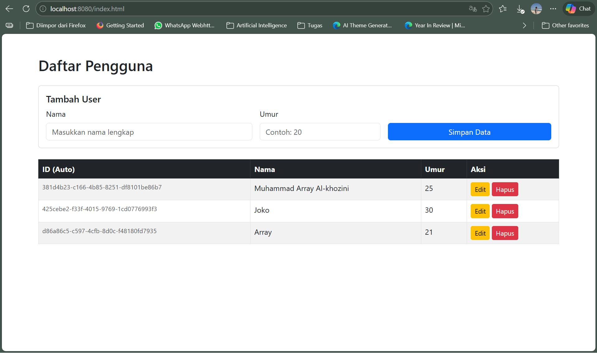

# 📘 Praktikum 1 - Spring Boot REST API

## Creator
**Muhammad Array Al-khozini**

**20230140208**

---

## 🖥️ Tampilan Web (Frontend)

Akses halaman web di: `http://localhost:8080/index.html`



**Fitur:**
- ✅ Tambah user baru (Nama & Umur)
- ✅ Lihat daftar semua user
- ✅ Edit data user
- ✅ Hapus data user
- ✅ ID otomatis (UUID)

---

## 📡 API Documentation

### Base URL

```
http://localhost:8080
```

---

### 1️⃣ Tambah User (POST)

Menambahkan user baru ke database. ID di-generate otomatis (UUID).

**Endpoint:**

```
POST /api/users
```


**Request Body:**

```json
{
    "name": "Array",
    "age": 21
}
```

**Response (201 Created):**

```json
{
    "data": {
        "id": "d86a86c5-c597-4cfb-8d0c-f48180fd7935",
        "name": "Array",
        "age": 21
    },
    "status": "success"
}
```

**Contoh cURL:**

```bash
curl -X POST http://localhost:8080/api/users \
  -H "Content-Type: application/json" \
  -d '{"name": "Array", "age": 21}'
```

---

### 2️⃣ Ambil Semua User (GET)

Mengambil seluruh data user dari database.

**Endpoint:**

```
GET /api/users
```

**Headers:** Tidak diperlukan

**Response (200 OK):**

```json
{
    "data": [
        {
            "id": "425cebe2-f33f-4015-9769-1cd0776993f3",
            "name": "Joko",
            "age": 30
        },
        {
            "id": "d86a86c5-c597-4cfb-8d0c-f48180fd7935",
            "name": "Array",
            "age": 21
        }
    ],
    "status": "success"
}
```

**Contoh cURL:**

```bash
curl -X GET http://localhost:8080/api/users
```

---

### 3️⃣ Ambil User by ID (GET)

Mengambil data satu user berdasarkan ID.

**Endpoint:**

```
GET /api/users/{id}
```

**Path Parameter:**

| Parameter | Tipe   | Deskripsi          |
|-----------|--------|--------------------|
| id        | String | UUID dari user     |

**Response (200 OK):**

```json
{
    "data": {
        "id": "d86a86c5-c597-4cfb-8d0c-f48180fd7935",
        "name": "Array",
        "age": 21
    },
    "status": "success"
}
```

**Contoh cURL:**

```bash
curl -X GET http://localhost:8080/api/users/d86a86c5-c597-4cfb-8d0c-f48180fd7935
```

---

### 4️⃣ Update User (PUT)

Mengupdate data user berdasarkan ID.

**Endpoint:**

```
PUT /api/users/{id}
```

**Path Parameter:**

| Parameter | Tipe   | Deskripsi          |
|-----------|--------|--------------------|
| id        | String | UUID dari user     |

**Headers:**

| Key            | Value              |
|----------------|--------------------|
| Content-Type   | application/json   |

**Request Body:**

```json
{
    "name": "Array Updated",
    "age": 25
}
```

**Response (200 OK):**

```json
{
    "data": {
        "id": "d86a86c5-c597-4cfb-8d0c-f48180fd7935",
        "name": "Array Updated",
        "age": 25
    },
    "status": "success"
}
```

**Contoh cURL:**

```bash
curl -X PUT http://localhost:8080/api/users/d86a86c5-c597-4cfb-8d0c-f48180fd7935 \
  -H "Content-Type: application/json" \
  -d '{"name": "Array Updated", "age": 25}'
```

---

### 5️⃣ Hapus User (DELETE)

Menghapus user berdasarkan ID.

**Endpoint:**

```
DELETE /api/users/{id}
```

**Path Parameter:**

| Parameter | Tipe   | Deskripsi          |
|-----------|--------|--------------------|
| id        | String | UUID dari user     |

**Response (200 OK):**

```json
{
    "status": "success delete user with id d86a86c5-c597-4cfb-8d0c-f48180fd7935"
}
```

**Contoh cURL:**

```bash
curl -X DELETE http://localhost:8080/api/users/d86a86c5-c597-4cfb-8d0c-f48180fd7935
```

---

## 📋 Ringkasan Endpoint

| No | Method     | Endpoint              | Deskripsi              | Request Body | Status Code |
|----|------------|-----------------------|------------------------|--------------|-------------|
| 1  | `POST`     | `/api/users`          | Tambah user baru       | ✅ JSON      | 201 Created |
| 2  | `GET`      | `/api/users`          | Ambil semua user       | ❌           | 200 OK      |
| 3  | `GET`      | `/api/users/{id}`     | Ambil user by ID       | ❌           | 200 OK      |
| 4  | `PUT`      | `/api/users/{id}`     | Update user by ID      | ✅ JSON      | 200 OK      |
| 5  | `DELETE`   | `/api/users/{id}`     | Hapus user by ID       | ❌           | 200 OK      |

---


### 415 Unsupported Media Type

```json
{
    "timestamp": "2026-03-04T03:09:21.778Z",
    "status": 415,
    "error": "Unsupported Media Type",
    "path": "/api/users/{id}"
}
```

> **Solusi:** Pastikan header `Content-Type: application/json` ditambahkan pada request `POST` dan `PUT`.

---


